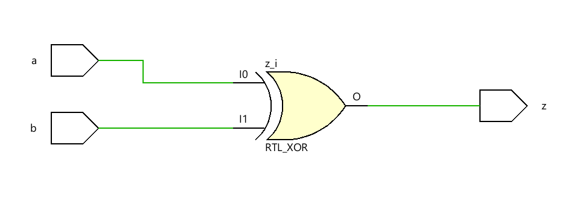
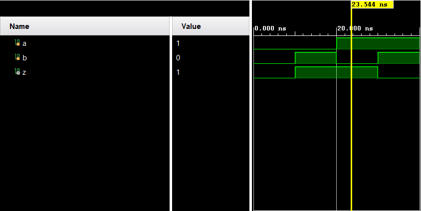

**EX-OR Gate**


**Structural (Gate-Level) Modeling**

**Code** 
```
module Code(
input a,b,
output z
    );
    xor (z,a,b);
endmodule
```

**Testbench**
```
module Testbench(
    );
    reg a,b;
    wire z;
    Code uut(a,b,z);
    initial
    begin
    a=0; b=0;
    #10 a=0; b=1;
    #10 a=1; b=0;
    #10 a=1; b=1;
    #10 $finish;
    end
endmodule
```

**Dataflow Modeling**

**Code**
```
module Code(
input wire a,b,
output wire z
    );
    assign z=a^b;
endmodule
```
**Testbench**
```
module Testbench(
    );
    reg a,b;
    wire z;
    Code uut(a,b,z);
    initial
    begin
    a=0; b=0;
    #10 a=0; b=1;
    #10 a=1; b=0;
    #10 a=1; b=1;
    #10 $finish;
    end
endmodule
```
**Behavioral Modeling**

**Code**
```
module Code(
input wire a,b,
output reg z
    );
    always@(*) begin
    z=a^b;
    end
endmodule
```
**Testbench**
```
module Testbench(
    );
    reg a,b;
    wire z;
    Code uut(a,b,z);
    initial
    begin
    a=0; b=0;
    #10 a=0; b=1;
    #10 a=1; b=0;
    #10 a=1; b=1;
    #10 $finish;
    end
endmodule

```


