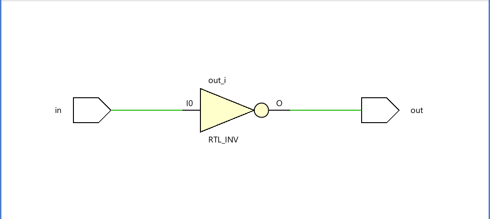
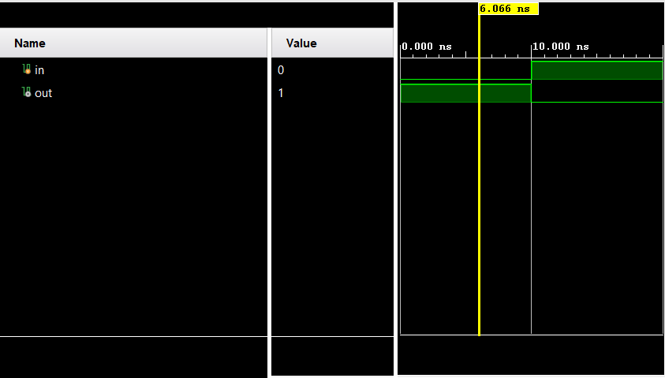

**Not Gate**

**Structural (Gate-Level) Modeling**

**Code** 
```
module Code(
input wire in,
output wire out
    );
    not gate(out,in);
endmodule
```

**Testbench**
```
module Testbench1(
    );
    reg in;
    wire out;
    Code uut(in,out); 
    initial 
    begin 
    
    in=0;
    #10 
    in=1;
    #10 $finish;
    end
endmodule
```

**Dataflow Modeling**

**Code**
```
module Code(
input wire in,
output wire out
    );
    assign out = ~in;
endmodule
```
**Testbench**
```
module Testbench1(
    );
    reg in;
    wire out;
    Code uut(in,out);
    initial 
    begin 
    
    in=0;
    #10 
    in=1;
    #10 $finish;
    end
endmodule
```
**Behavioral Modeling**

**Code**
```
module Code(
input wire in,
output reg out

    );
    always@ (*) begin
    out = ~in;
    end
endmodule
```
**Testbench**
```
module Testbench1(
    );
    reg in;
    wire out;
    Code uut(in,out);
    initial 
    begin 
    
    in=0;
    #10 
    in=1;
    #10 $finish;
    end
endmodule
```


